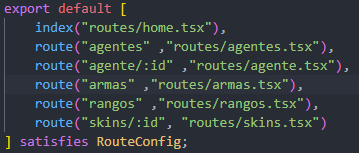

# Proyecto Final - Desarrollo Web en Entorno Cliente (DWEC)

Este proyecto es similar al que ya hicimos en el primer trimestre, sin embargo, este preoyecto ha sido realizado con React Router, por lo que tuvimos que adaptar codigo y acceso a la API, ademas de la creacion de componentes y de interfaces.

# Estructura del proyecto

```
├── app/
│   ├── components/     # Componetes utilizados en la practica
│   ├── routes/     # Las rutas de la pagina
│   ├── styles/     # Estilos para las paginas
│   └── types/      # Interfaces para los componentes
├── app.css     # Estilos generales 
├── routes.tsx      # Rutas para el acceso a distintas paginas
```

## Componentes

Tenemos distintos componentes como el Header, la Card de los agentes, de las armas.

Tambien tenemos un acordeon con los rangos, en el que se encuentran los 3 niveles de anidamiento.

### Anidamiento del acordeón

El componente más pequeño es RankCard, en el que deberia de mostrar el nombre del rango y su imagen.

El siguiente componente es AcordeonItem, en el que se muestra el nombre de las divisiones, y dentro de ellos los distintos rangos con su RankCard.

El componente padre es Acordeon, en el que hacemos la peticion a la Api para por cada division, hacer un AcordeonItem.

## Routes

En esta carpeta se encuentran las paginas a las que accedemos despues.

- **home.tsx**

    Esta es la pagina principal del proyecto, la que se muestra al desplegar.

- **agentes.tsx y agente.tsxx**

    En *agentes.tsx* mostramos los diferentes agentes seleccionables, si clicamos en cualquiera de ellos, nos redirige a una pagina personalizada para ese agentes, *agente.tsx*, en el que mostramos su informacion detallada.

- **armas.tsx y skins.tsx**

    Aqui, en *armas.tsx*, mostramos los diferentes tipos de armas, con sus categorias, y al hacer click en ellas nos redirige a *skins.tsx* donde se muestran todas las skins del arma, que podemos filtrar por rareza.

## Styles y Types

Aqui sencillamente se encuentran diferentes archivos css para personalizacion en la carpeta *styles* y los props para los componentes en la carpeta *types*.

## Routes.tsx

En este archivo se definen las rutas que tiene el proyecto. 



Vemos que la pagina *index* es la *home.tsx*.

Para acceder a las paginas *agente.tsx* y *skins.tsx* le pasamos un parametro, despues recogemos el parametro y se lo pasamos al fetch para la paticion de la API.